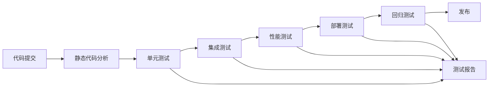

# SmartScope 工业双目内窥镜系统 - 细化测试项目计划

## 1. 测试项目总览

### 1.1 测试项目分类
基于现有代码结构和功能模块，将测试项目细化为以下几个主要类别：

```
测试项目层次结构：
├── 单元测试 (Unit Tests)
│   ├── 基础设施层测试
│   ├── 核心层测试
│   ├── 应用层测试
│   └── 工具层测试
├── 集成测试 (Integration Tests)
│   ├── 模块间集成测试
│   ├── 系统集成测试
│   └── 端到端测试
├── 性能测试 (Performance Tests)
│   ├── 基准性能测试
│   ├── 压力测试
│   └── 稳定性测试
├── 专项测试 (Specialized Tests)
│   ├── 算法精度测试
│   ├── 硬件兼容性测试
│   └── 用户体验测试
└── 自动化测试 (Automated Tests)
    ├── 回归测试
    ├── 持续集成测试
    └── 部署测试
```

### 1.2 测试优先级矩阵

| 测试类别 | P0 (关键) | P1 (重要) | P2 (一般) | P3 (可选) |
|----------|-----------|-----------|-----------|-----------|
| 单元测试 | 核心算法、相机管理 | 配置管理、日志系统 | UI组件、工具类 | 辅助功能 |
| 集成测试 | 相机-立体视觉 | 推理服务集成 | 数据存储集成 | 报告生成 |
| 性能测试 | 实时处理性能 | 内存使用、响应时间 | 并发处理 | 资源优化 |
| 专项测试 | 测量精度 | 算法准确性 | 硬件兼容性 | 用户体验 |

## 2. 详细测试项目规划

### 2.1 单元测试项目 (40个测试项目)

#### 2.1.1 基础设施层测试 (12项)

**配置管理模块测试 (4项)**
- **UT_CONFIG_001**: 配置文件加载测试
  - 测试目标：验证 TOML 配置文件正确加载
  - 测试数据：有效/无效配置文件
  - 验收标准：加载成功率 100%，错误处理正确

- **UT_CONFIG_002**: 配置参数验证测试
  - 测试目标：验证配置参数类型和范围检查
  - 测试数据：边界值、非法值
  - 验收标准：参数验证准确率 100%

- **UT_CONFIG_003**: 配置动态更新测试
  - 测试目标：验证运行时配置更新功能
  - 测试数据：各种配置参数组合
  - 验收标准：更新响应时间 < 100ms

- **UT_CONFIG_004**: 配置持久化测试
  - 测试目标：验证配置保存和恢复功能
  - 测试数据：修改后的配置
  - 验收标准：数据一致性 100%

**日志系统测试 (4项)**
- **UT_LOG_001**: 多级别日志测试
  - 测试目标：验证 DEBUG/INFO/WARNING/ERROR/FATAL 级别
  - 测试数据：各级别日志消息
  - 验收标准：日志级别过滤正确

- **UT_LOG_002**: 日志格式化测试
  - 测试目标：验证日志格式和时间戳
  - 测试数据：不同类型的日志消息
  - 验收标准：格式符合规范

- **UT_LOG_003**: 日志轮转测试
  - 测试目标：验证日志文件大小和数量控制
  - 测试数据：大量日志数据
  - 验收标准：文件大小控制在设定范围内

- **UT_LOG_004**: 日志性能测试
  - 测试目标：验证高频日志写入性能
  - 测试数据：1000条/秒日志
  - 验收标准：不影响主程序性能

**异常处理测试 (4项)**
- **UT_EXC_001**: 异常类型层次测试
- **UT_EXC_002**: 异常信息本地化测试
- **UT_EXC_003**: 异常捕获和传播测试
- **UT_EXC_004**: 异常恢复机制测试

#### 2.1.2 核心层测试 (20项)

**相机模块测试 (8项)**
- **UT_CAM_001**: 相机设备发现测试
  - 测试目标：验证 USB 相机自动发现功能
  - 测试数据：不同型号 USB 相机
  - 验收标准：发现率 ≥ 95%

- **UT_CAM_002**: 相机连接管理测试
  - 测试目标：验证相机连接/断开功能
  - 测试数据：正常/异常连接场景
  - 验收标准：连接成功率 ≥ 95%

- **UT_CAM_003**: 相机参数控制测试
  - 测试目标：验证曝光、增益、白平衡等参数设置
  - 测试数据：参数边界值
  - 验收标准：参数设置响应时间 < 100ms

- **UT_CAM_004**: 双目同步测试
  - 测试目标：验证双目相机时间戳同步
  - 测试数据：连续帧序列
  - 验收标准：同步精度 ≤ 1ms

- **UT_CAM_005**: 帧缓冲管理测试
- **UT_CAM_006**: 相机异常恢复测试
- **UT_CAM_007**: 热插拔处理测试
- **UT_CAM_008**: 多相机管理测试

**立体视觉模块测试 (8项)**
- **UT_STE_001**: BM 算法测试
  - 测试目标：验证 Block Matching 算法正确性
  - 测试数据：标准立体图像对
  - 验收标准：视差计算精度 ≤ 2%

- **UT_STE_002**: SGBM 算法测试
  - 测试目标：验证 Semi-Global Block Matching 算法
  - 测试数据：复杂场景图像对
  - 验收标准：处理时间 < 200ms

- **UT_STE_003**: 神经网络立体匹配测试
  - 测试目标：验证深度学习立体匹配
  - 测试数据：ONNX/RKNN 模型
  - 验收标准：推理时间 < 100ms

- **UT_STE_004**: 视差后处理测试
- **UT_STE_005**: 深度图生成测试
- **UT_STE_006**: 点云转换测试
- **UT_STE_007**: 算法参数优化测试
- **UT_STE_008**: 立体校正测试

**推理模块测试 (4项)**
- **UT_INF_001**: ONNX 模型加载测试
- **UT_INF_002**: RKNN 模型推理测试
- **UT_INF_003**: 推理队列管理测试
- **UT_INF_004**: 硬件加速测试

#### 2.1.3 应用层测试 (8项)

**UI 模块测试 (4项)**
- **UT_UI_001**: 主窗口布局测试
- **UT_UI_002**: 控件交互测试
- **UT_UI_003**: 页面切换测试
- **UT_UI_004**: 主题样式测试

**测量功能测试 (4项)**
- **UT_MEA_001**: 距离测量算法测试
- **UT_MEA_002**: 面积计算测试
- **UT_MEA_003**: 角度测量测试
- **UT_MEA_004**: 测量精度验证测试

### 2.2 集成测试项目 (25个测试项目)

#### 2.2.1 模块间集成测试 (15项)

**相机-立体视觉集成 (5项)**
- **IT_CAM_STE_001**: 相机采集到立体匹配流程测试
  - 测试目标：验证完整的图像处理流水线
  - 测试数据：实时双目图像流
  - 验收标准：端到端延迟 < 300ms

- **IT_CAM_STE_002**: 同步帧立体处理测试
- **IT_CAM_STE_003**: 参数联动测试
- **IT_CAM_STE_004**: 异常传播测试
- **IT_CAM_STE_005**: 性能协调测试

**立体视觉-推理集成 (5项)**
- **IT_STE_INF_001**: 传统算法与 AI 算法切换测试
- **IT_STE_INF_002**: 推理结果后处理集成测试
- **IT_STE_INF_003**: 模型热切换测试
- **IT_STE_INF_004**: 推理性能优化集成测试
- **IT_STE_INF_005**: 错误处理集成测试

**数据流集成 (5项)**
- **IT_DATA_001**: 配置-模块联动测试
- **IT_DATA_002**: 日志-异常集成测试
- **IT_DATA_003**: 文件存储集成测试
- **IT_DATA_004**: 数据导入导出集成测试
- **IT_DATA_005**: 缓存管理集成测试

#### 2.2.2 系统集成测试 (10项)

**完整工作流测试 (5项)**
- **IT_SYS_001**: 启动到关闭完整流程测试
- **IT_SYS_002**: 相机标定工作流测试
- **IT_SYS_003**: 测量工作流测试
- **IT_SYS_004**: 报告生成工作流测试
- **IT_SYS_005**: 数据管理工作流测试

**多用户场景测试 (5项)**
- **IT_SYS_006**: 并发操作测试
- **IT_SYS_007**: 权限控制测试
- **IT_SYS_008**: 配置隔离测试
- **IT_SYS_009**: 资源竞争测试
- **IT_SYS_010**: 状态同步测试

### 2.3 性能测试项目 (15个测试项目)

#### 2.3.1 基准性能测试 (8项)

**实时处理性能 (4项)**
- **PT_RT_001**: 图像采集性能基准测试
  - 测试目标：测量相机采集帧率和延迟
  - 测试条件：不同分辨率和帧率设置
  - 验收标准：1280x720@30fps 稳定运行

- **PT_RT_002**: 立体匹配性能基准测试
  - 测试目标：测量各算法处理时间
  - 测试条件：标准测试图像集
  - 验收标准：SGBM < 200ms, BM < 100ms

- **PT_RT_003**: 推理性能基准测试
- **PT_RT_004**: 端到端延迟基准测试

**资源使用性能 (4项)**
- **PT_RES_001**: CPU 使用率测试
- **PT_RES_002**: 内存使用测试
- **PT_RES_003**: GPU/NPU 利用率测试
- **PT_RES_004**: 存储 I/O 性能测试

#### 2.3.2 压力测试 (4项)

- **PT_STR_001**: 高负载连续运行测试
- **PT_STR_002**: 内存压力测试
- **PT_STR_003**: 并发操作压力测试
- **PT_STR_004**: 极限参数测试

#### 2.3.3 稳定性测试 (3项)

- **PT_STA_001**: 24小时连续运行测试
- **PT_STA_002**: 内存泄漏检测测试
- **PT_STA_003**: 异常恢复稳定性测试

### 2.4 专项测试项目 (20个测试项目)

#### 2.4.1 算法精度测试 (8项)

**立体匹配精度 (4项)**
- **ST_ACC_001**: 标准数据集精度测试
  - 测试目标：使用 Middlebury 等标准数据集验证算法精度
  - 测试数据：Teddy, Cones, Tsukuba 等标准图像对
  - 验收标准：错误率 < 5%

- **ST_ACC_002**: 实际场景精度测试
- **ST_ACC_003**: 不同光照条件精度测试
- **ST_ACC_004**: 纹理变化适应性测试

**测量精度测试 (4项)**
- **ST_MEA_001**: 距离测量精度标定测试
  - 测试目标：使用标准件验证距离测量精度
  - 测试数据：已知尺寸的标准件
  - 验收标准：测量误差 < 0.5mm

- **ST_MEA_002**: 面积测量精度测试
- **ST_MEA_003**: 角度测量精度测试
- **ST_MEA_004**: 复杂几何体测量测试

#### 2.4.2 硬件兼容性测试 (8项)

**相机兼容性 (4项)**
- **ST_HW_001**: 不同品牌相机兼容性测试
- **ST_HW_002**: 不同分辨率支持测试
- **ST_HW_003**: USB 接口兼容性测试
- **ST_HW_004**: 驱动兼容性测试

**平台兼容性 (4项)**
- **ST_HW_005**: RK3588 平台优化测试
- **ST_HW_006**: 不同 Linux 发行版测试
- **ST_HW_007**: 硬件加速兼容性测试
- **ST_HW_008**: 外设兼容性测试

#### 2.4.3 用户体验测试 (4项)

- **ST_UX_001**: 界面易用性测试
- **ST_UX_002**: 操作流程优化测试
- **ST_UX_003**: 错误提示友好性测试
- **ST_UX_004**: 学习曲线测试

## 3. 自动化测试框架

### 3.1 测试框架架构

```
自动化测试框架结构：
├── 测试执行引擎
│   ├── 单元测试执行器 (Google Test)
│   ├── 集成测试执行器 (Qt Test)
│   ├── 性能测试执行器 (自研)
│   └── 专项测试执行器 (自研)
├── 测试数据管理
│   ├── 标准测试数据集
│   ├── 模拟数据生成器
│   ├── 测试结果数据库
│   └── 基准数据管理
├── 测试工具集
│   ├── 相机模拟器
│   ├── 性能监控工具
│   ├── 图像质量评估工具
│   └── 报告生成工具
└── 持续集成
    ├── Jenkins 流水线
    ├── 自动化部署
    ├── 回归测试
    └── 质量门禁
```

### 3.2 测试工具开发计划

#### 3.2.1 核心测试工具 (8个工具)

**相机测试工具**
- **TOOL_001**: 虚拟相机模拟器
  - 功能：模拟双目相机输出标准测试图像
  - 特性：支持不同分辨率、帧率、噪声级别
  - 用途：单元测试、集成测试、性能测试

- **TOOL_002**: 相机同步验证工具
  - 功能：验证双目相机时间戳同步精度
  - 特性：微秒级时间戳分析、同步质量评估
  - 用途：相机模块测试、系统集成测试

**算法测试工具**
- **TOOL_003**: 立体匹配精度评估工具
  - 功能：对比算法输出与标准答案
  - 特性：支持多种精度指标、可视化对比
  - 用途：算法精度测试、性能优化

- **TOOL_004**: 深度学习模型验证工具
  - 功能：验证 ONNX/RKNN 模型推理结果
  - 特性：模型性能分析、精度对比
  - 用途：推理模块测试、模型优化

**性能测试工具**
- **TOOL_005**: 实时性能监控工具
  - 功能：监控 CPU、内存、GPU 使用率
  - 特性：实时图表、性能报警、数据导出
  - 用途：性能测试、稳定性测试

- **TOOL_006**: 内存泄漏检测工具
  - 功能：检测内存泄漏和资源泄漏
  - 特性：基于 Valgrind，自动化报告
  - 用途：稳定性测试、质量保证

**测量精度工具**
- **TOOL_007**: 测量精度标定工具
  - 功能：使用标准件标定测量精度
  - 特性：自动化标定流程、精度报告
  - 用途：测量功能测试、系统标定

- **TOOL_008**: 图像质量评估工具
  - 功能：评估图像质量和处理效果
  - 特性：多种质量指标、批量处理
  - 用途：图像处理测试、算法优化

#### 3.2.2 测试数据管理

**标准测试数据集**
- Middlebury 立体视觉数据集
- KITTI 自动驾驶数据集
- 自制工业检测数据集
- 相机标定数据集

**测试数据生成器**
- 合成立体图像对生成器
- 噪声图像生成器
- 不同光照条件模拟器
- 几何变形模拟器

### 3.3 持续集成流水线

#### 3.3.1 CI/CD 流程设计



#### 3.3.2 质量门禁标准

**代码质量门禁**
- 代码覆盖率 ≥ 90%
- 静态分析无严重问题
- 单元测试通过率 100%
- 集成测试通过率 ≥ 95%

**性能质量门禁**
- 关键路径性能不退化
- 内存使用不超过基线 10%
- CPU 使用率 ≤ 80%
- 无内存泄漏

## 4. 测试执行计划

### 4.1 测试阶段规划

#### 4.1.1 第一阶段：基础测试 (4周)

**Week 1-2: 单元测试**
- 基础设施层测试 (12项)
- 核心层基础测试 (10项)
- 测试工具开发 (4个)

**Week 3-4: 模块集成测试**
- 相机-立体视觉集成 (5项)
- 基础性能测试 (4项)
- 测试框架完善

#### 4.1.2 第二阶段：系统测试 (6周)

**Week 5-6: 核心功能测试**
- 立体视觉模块完整测试 (8项)
- 推理模块测试 (4项)
- 应用层测试 (8项)

**Week 7-8: 集成和性能测试**
- 系统集成测试 (10项)
- 性能基准测试 (8项)
- 压力测试 (4项)

**Week 9-10: 专项测试**
- 算法精度测试 (8项)
- 硬件兼容性测试 (8项)
- 用户体验测试 (4项)

#### 4.1.3 第三阶段：验收测试 (2周)

**Week 11: 稳定性测试**
- 长时间运行测试
- 异常恢复测试
- 边界条件测试

**Week 12: 最终验收**
- 用户验收测试
- 性能验收测试
- 文档验收测试

### 4.2 测试资源分配

#### 4.2.1 人力资源配置

| 角色 | 人数 | 主要职责 | 参与阶段 |
|------|------|----------|----------|
| 测试经理 | 1 | 测试计划、进度管理 | 全程 |
| 单元测试工程师 | 2 | 单元测试开发和执行 | 1-2阶段 |
| 集成测试工程师 | 2 | 集成测试和系统测试 | 2-3阶段 |
| 性能测试工程师 | 1 | 性能测试和优化 | 2-3阶段 |
| 自动化工程师 | 1 | 测试工具和框架开发 | 全程 |
| 算法测试专家 | 1 | 算法精度和专项测试 | 2-3阶段 |

#### 4.2.2 硬件资源配置

**测试设备清单**
- RK3588 开发板 × 5台
- USB 双目相机 × 10套 (不同型号)
- 标准测量件 × 20套
- 高精度测量设备 × 2套
- 网络测试设备 × 1套
- 服务器 (CI/CD) × 1台

#### 4.2.3 软件工具配置

**开发和测试工具**
- Google Test Framework
- Qt Test Framework
- Valgrind (内存检测)
- Perf (性能分析)
- Jenkins (CI/CD)
- SonarQube (代码质量)
- Grafana (监控面板)

### 4.3 风险管理和应急预案

#### 4.3.1 主要风险识别

**技术风险**
- 算法精度不达标
- 性能指标无法满足
- 硬件兼容性问题
- 第三方库依赖问题

**资源风险**
- 测试设备不足
- 人力资源紧张
- 测试环境不稳定
- 测试数据不充分

**进度风险**
- 开发延期影响测试
- 测试发现重大问题
- 测试工具开发延期
- 外部依赖延期

#### 4.3.2 应急预案

**技术问题应急**
- 建立技术专家支持组
- 准备备选技术方案
- 建立问题升级机制
- 制定质量标准调整预案

**资源问题应急**
- 建立资源共享机制
- 准备外部资源采购
- 制定优先级调整方案
- 建立远程测试能力

**进度问题应急**
- 制定并行测试方案
- 准备测试范围调整
- 建立快速修复流程
- 制定发布标准调整

## 5. 测试质量保证

### 5.1 测试过程质量控制

**测试用例质量**
- 测试用例评审机制
- 测试覆盖率要求
- 测试数据质量标准
- 测试结果可重现性

**测试执行质量**
- 测试环境标准化
- 测试步骤规范化
- 测试结果记录标准
- 缺陷跟踪流程

### 5.2 测试效果评估

**量化指标**
- 缺陷发现率
- 测试覆盖率
- 测试执行效率
- 缺陷修复率

**质量指标**
- 功能正确性
- 性能达标率
- 稳定性指标
- 用户满意度

### 5.3 持续改进机制

**测试过程改进**
- 定期测试回顾
- 测试方法优化
- 工具效率提升
- 流程标准化

**测试能力建设**
- 团队技能培训
- 测试工具升级
- 测试数据积累
- 经验知识沉淀
