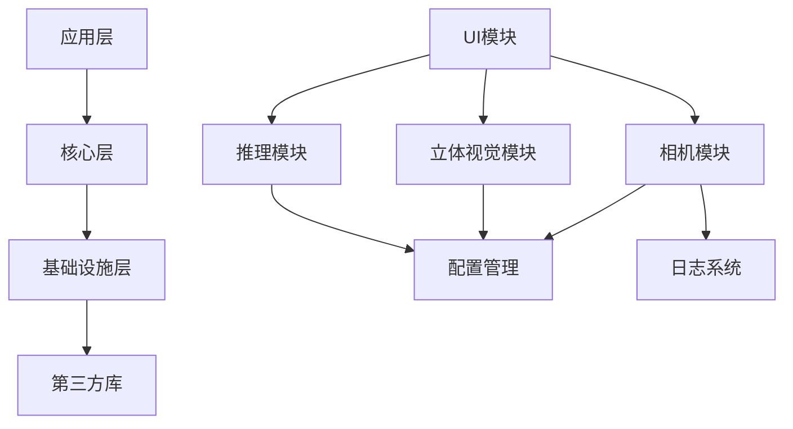

# SmartScope 工业双目内窥镜系统 - 软件设计说明书

## 1. 项目概述

### 1.1 项目背景
SmartScope 是一个基于 Qt 和 OpenCV 的工业双目内窥镜系统，专门用于工业检测和质量控制。系统采用双目立体视觉技术，能够实时获取被检测物体的三维信息，为工业检测提供精确的深度测量和缺陷识别能力。

### 1.2 系统特点
- **模块化设计**：采用分层架构，各模块职责清晰，便于维护和扩展
- **实时处理**：支持实时双目图像采集、立体匹配和深度计算
- **智能推理**：集成深度学习模型，支持 ONNX 和 RKNN 格式
- **高性能**：支持多线程处理，GPU/NPU 硬件加速
- **工业级**：稳定可靠，支持长时间连续运行

### 1.3 技术栈
- **开发语言**：C++17
- **UI 框架**：Qt 5.15+
- **计算机视觉**：OpenCV 4.5+
- **点云处理**：PCL (Point Cloud Library)
- **深度学习**：ONNX Runtime, RKNN
- **构建系统**：CMake 3.10+
- **硬件平台**：RK3588 (ARM64)

## 2. 系统架构

### 2.1 整体架构
系统采用分层模块化架构，从下到上分为：

```
┌─────────────────────────────────────────────────────────┐
│                    应用层 (Application)                    │
├─────────────────────────────────────────────────────────┤
│                     核心层 (Core)                        │
├─────────────────────────────────────────────────────────┤
│                  基础设施层 (Infrastructure)               │
├─────────────────────────────────────────────────────────┤
│                   第三方库 (Third Party)                  │
└─────────────────────────────────────────────────────────┘
```

### 2.2 模块依赖关系


## 3. 核心模块设计

### 3.1 相机模块 (Camera Module)

#### 3.1.1 设计目标
- 支持多相机同时管理
- 实现双目相机同步采集
- 提供统一的相机接口
- 支持相机参数动态调节

#### 3.1.2 核心类设计

**MultiCameraManager** - 多相机管理器
```cpp
class MultiCameraManager {
public:
    static MultiCameraManager& instance();
    
    // 相机管理
    bool addCamera(const std::string& cameraId, const std::string& cameraName, const CameraConfig& config);
    bool removeCamera(const std::string& cameraId);
    bool startCamera(const std::string& cameraId);
    bool stopCamera(const std::string& cameraId);
    
    // 同步采集
    bool getSyncFrames(std::map<std::string, cv::Mat>& frames, 
                       std::map<std::string, int64_t>& timestamps,
                       int syncThresholdMs = 50);
    
    // 状态查询
    CameraInfo getCameraInfo(const std::string& cameraId);
    std::vector<CameraInfo> getAllCameraInfo();
    
private:
    std::map<std::string, CameraInfo> cameras_;
    std::map<std::string, std::unique_ptr<FrameBuffer>> buffers_;
    std::mutex mutex_;
    bool running_;
};
```

**Camera** - 相机抽象基类
```cpp
class Camera : public QObject {
    Q_OBJECT
    
public:
    enum class Type { USB, NETWORK, FILE, VIRTUAL };
    enum class Property { BRIGHTNESS, CONTRAST, EXPOSURE, GAIN, ... };
    
    virtual bool open() = 0;
    virtual void close() = 0;
    virtual bool getFrame(QImage& image) = 0;
    virtual bool setProperty(Property property, double value) = 0;
    
signals:
    void newFrame(const QImage& frame);
    void error(const QString& message);
};
```

#### 3.1.3 同步机制
- **时间戳同步**：基于硬件时间戳进行帧同步
- **缓冲区管理**：每个相机维护独立的环形缓冲区
- **同步策略**：支持低延迟和高精度两种同步模式

### 3.2 立体视觉模块 (Stereo Vision Module)

#### 3.2.1 设计目标
- 实现高精度立体匹配
- 支持多种匹配算法
- 提供实时深度计算
- 支持参数动态调优

#### 3.2.2 算法支持
- **传统算法**：BM (Block Matching), SGBM (Semi-Global Block Matching)
- **深度学习**：基于神经网络的立体匹配
- **后处理**：视差滤波、空洞填充、边缘优化

### 3.3 推理模块 (Inference Module)

#### 3.3.1 设计目标
- 支持多种深度学习框架
- 实现异步推理处理
- 支持硬件加速
- 提供推理结果缓存

#### 3.3.2 核心类设计

**InferenceService** - 推理服务
```cpp
class InferenceService : public QObject {
    Q_OBJECT
    
public:
    static InferenceService& instance();
    
    bool initialize(const QString& model_path);
    void submitRequest(const InferenceRequest& request);
    void setPerformanceMode(PerformanceMode mode);
    
signals:
    void inferenceCompleted(const InferenceResult& result);
    
private:
    std::unique_ptr<StereoInference> m_inference;
    QQueue<InferenceRequest> m_requestQueue;
    QThread m_workerThread;
};
```

**StereoInference** - 立体推理引擎
```cpp
class StereoInference {
public:
    enum class PerformanceMode { SPEED, BALANCED, QUALITY };
    
    bool loadModel(const std::string& model_path);
    cv::Mat inference(const cv::Mat& left_img, const cv::Mat& right_img);
    void savePointCloud(const cv::Mat& disparity, const cv::Mat& color, 
                       const std::string& filename);
    
private:
    std::unique_ptr<Ort::Session> ort_session_;
    PerformanceMode performance_mode_;
};
```

## 4. 用户界面设计

### 4.1 主界面布局
```
┌─────────────────────────────────────────────────────────┐
│  菜单栏                                                   │
├─────────────────────────────────────────────────────────┤
│  工具栏                                                   │
├─────────┬─────────────────────────────┬─────────────────┤
│         │                             │                 │
│  控制   │        主显示区域              │    参数面板      │
│  面板   │                             │                 │
│         │                             │                 │
├─────────┴─────────────────────────────┴─────────────────┤
│  状态栏                                                   │
└─────────────────────────────────────────────────────────┘
```

### 4.2 主要页面
- **主页**：实时双目图像显示和基本控制
- **标定页**：相机标定和参数调节
- **测量页**：3D 测量和分析工具
- **设置页**：系统配置和参数设置

## 5. 数据流设计

### 5.1 图像处理流程


### 5.2 推理处理流程


## 6. 配置管理

### 6.1 配置文件结构
系统使用 TOML 格式的配置文件，主要包含：

```toml
[app]
name = "Smart Scope Qt"
version = "1.0.0"
log_level = "debug"

[camera.left]
name = ["cameraL", "Web Camera 2Ks"]
parameters_path = "camera_parameters/camera0_intrinsics.dat"

[camera.right]
name = ["cameraR", "USB Camera"]
parameters_path = "camera_parameters/camera1_intrinsics.dat"

[stereo]
matcher = "sgbm"
min_disparity = 0
num_disparities = 128
block_size = 9
```

### 6.2 配置管理器
- **ConfigManager**：单例模式，全局配置访问点
- **ConfigLoader**：支持多种格式配置文件加载
- **ConfigValidator**：配置参数验证和默认值管理

## 7. 异常处理和日志

### 7.1 异常处理策略
- **分层异常处理**：不同层级定义专门的异常类型
- **异常恢复**：关键模块支持异常自动恢复
- **用户友好**：向用户提供清晰的错误信息

### 7.2 日志系统
- **多级别日志**：DEBUG, INFO, WARNING, ERROR, FATAL
- **多输出目标**：控制台、文件、网络
- **性能日志**：关键操作的性能监控

## 8. 性能优化

### 8.1 多线程设计
- **图像采集线程**：独立线程处理相机数据采集
- **推理线程**：异步处理深度学习推理
- **UI 线程**：保持界面响应性

### 8.2 内存管理
- **对象池**：重用频繁创建的对象
- **智能指针**：自动内存管理，避免内存泄漏
- **缓冲区管理**：高效的图像缓冲区管理

### 8.3 硬件加速
- **GPU 加速**：OpenCV GPU 模块加速图像处理
- **NPU 加速**：RKNN 框架加速神经网络推理
- **多核优化**：OpenMP 并行化计算密集型操作

## 9. 部署和运行环境

### 9.1 硬件要求
- **处理器**：RK3588 (ARM64) 或兼容处理器
- **内存**：至少 4GB RAM，推荐 8GB+
- **存储**：至少 16GB 可用空间
- **相机**：支持 USB 3.0 的双目相机
- **显示**：1920x1080 或更高分辨率

### 9.2 软件依赖
- **操作系统**：Linux (Ubuntu 20.04+ 或兼容发行版)
- **Qt 运行时**：Qt 5.15+
- **OpenCV**：4.5+
- **PCL**：1.10+
- **ONNX Runtime**：1.12+
- **RKNN Runtime**：1.4+

### 9.3 安装部署
```bash
# 1. 安装系统依赖
sudo apt update
sudo apt install qt5-default libopencv-dev libpcl-dev

# 2. 编译项目
mkdir build && cd build
cmake ..
make -j$(nproc)

# 3. 运行程序
./SmartScopeQt
```

## 10. 测试策略

### 10.1 单元测试
- **相机模块测试**：相机连接、参数设置、图像采集
- **立体视觉测试**：立体匹配算法、深度计算精度
- **推理模块测试**：模型加载、推理性能、结果准确性

### 10.2 集成测试
- **端到端测试**：完整的图像采集到结果输出流程
- **性能测试**：系统负载、内存使用、处理延迟
- **稳定性测试**：长时间运行稳定性

### 10.3 测试工具
```cpp
// 示例测试用例
TEST(CameraTest, BasicConnection) {
    MultiCameraManager& manager = MultiCameraManager::instance();
    CameraConfig config;
    EXPECT_TRUE(manager.addCamera("test_cam", "Test Camera", config));
    EXPECT_TRUE(manager.startCamera("test_cam"));
}

TEST(StereoTest, DisparityCalculation) {
    StereoInference inference;
    cv::Mat left = cv::imread("test_left.png");
    cv::Mat right = cv::imread("test_right.png");
    cv::Mat disparity = inference.inference(left, right);
    EXPECT_FALSE(disparity.empty());
}
```

## 11. 维护和扩展

### 11.1 代码规范
- **命名规范**：类名 PascalCase，函数名 camelCase，成员变量 m_camelCase
- **注释规范**：使用 Doxygen 风格注释，关键算法需详细说明
- **代码风格**：4 空格缩进，120 字符行宽限制

### 11.2 版本控制
- **分支策略**：feature/功能名，fix/问题描述，release/版本号
- **提交规范**：feat/fix/docs/style/refactor/test/chore
- **代码审查**：所有代码变更需要经过审查

### 11.3 扩展点
- **新算法集成**：通过接口扩展新的立体匹配算法
- **新硬件支持**：通过驱动层扩展新的相机硬件
- **新模型格式**：通过推理引擎扩展新的模型格式

## 12. 安全和可靠性

### 12.1 数据安全
- **配置加密**：敏感配置信息加密存储
- **访问控制**：关键功能需要权限验证
- **数据备份**：重要数据自动备份机制

### 12.2 系统可靠性
- **异常恢复**：关键模块异常自动恢复
- **资源监控**：内存、CPU 使用率监控
- **看门狗机制**：防止系统假死

### 12.3 故障诊断
- **诊断工具**：内置系统诊断功能
- **日志分析**：详细的错误日志和性能日志
- **远程调试**：支持远程诊断和调试

## 13. 总结

SmartScope 工业双目内窥镜系统采用现代化的软件架构设计，具有以下特点：

1. **模块化设计**：清晰的分层架构，便于维护和扩展
2. **高性能**：多线程处理，硬件加速，实时响应
3. **可靠性**：完善的异常处理和恢复机制
4. **可扩展性**：灵活的接口设计，支持功能扩展
5. **工业级**：稳定可靠，适合工业环境长期使用

该系统为工业检测提供了强大的双目视觉解决方案，能够满足各种复杂的工业检测需求。
